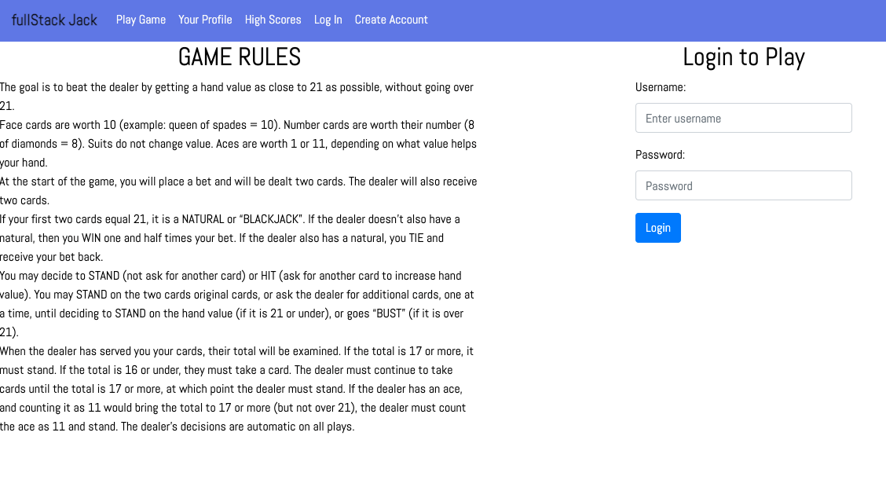
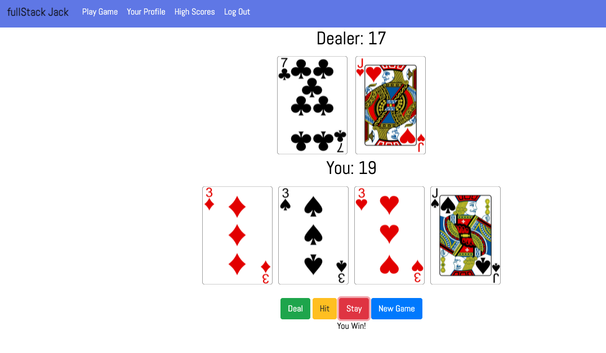

# UMN_bootcamp_project_two
# fullStack Jack

## Description:

fullStack Jack is an online card game. The goal of the game is to beat the dealer with a hand value of 21 or closest to 21. The purpose of fullStack Jack is for entertainment online. 

## Motivation:
Our motivation for this project was to apply our fullstack development skills to build an online card game. Another motive for this project was to present our collaborative abilities. 

## User Story:
- AS A card player
- I WANT play a simple game of blackjack online
- SO THAT I can learn the basic concepts of the game

## Technologies:
- Heroku (deployment)
- Node and Express (RESTful APIs)
- MySQL and Sequelize (databases)
- Handlebars (templating engine)
- Dependencies:
    - bcrypt
    - connect-session-sequelize
    - dotenv
    - engine-blackjack-tsExpress
    - express-handlebars
    - Express-session (authentication)
    - mySQL
    - mySQL2
    - Prettier
    - Sequelize
- MVC paradigm (folder structure)
- CSS, Bootstrap and Javascript 

## Github Repo: 
https://github.com/AcheronandStyx/full_stack_jack

## Deployed Page: 

## Screenshots: 

